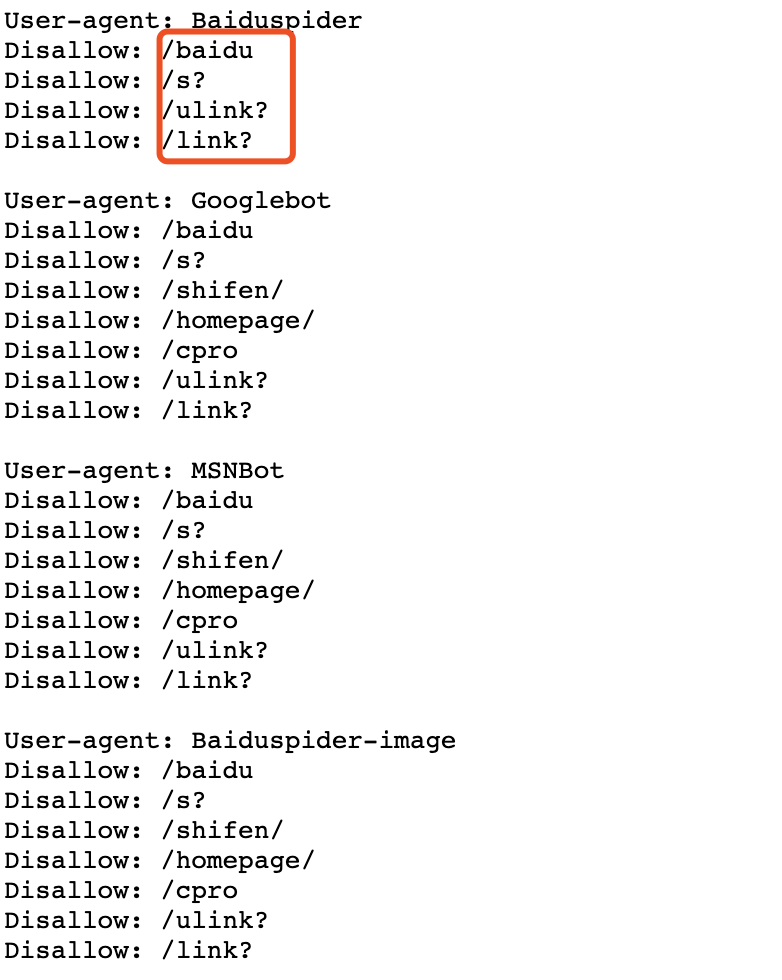

## 爬虫

网络爬虫是一种按照一定的规则，自动地抓取万维网信息的程序或者脚本。

### 法律责任

爬虫禁止爬取个人隐私数据和明确禁止他人访问的数据，甚至涉及版权保护的内容都不允许爬取后随意转载或者用于商业用途。

通过查看网站主页的robots.txt文档。判断网页内容是否可以爬取。

以百度为例：
[http://baidu.com/robots.txt](http://baidu.com/robots.txt)
可以查看里面有哪些内容不允许爬取。



### 入门技术
需要事先了解计算机网络（HTTP，Web，URL，URI）等网络知识；
了解HMTL中的tag, elements, attribute以及CSS，JavaScript ,DOM,JSON, Chrome浏览器的调试等
### 爬虫的一般步骤
1. 选择数据源，并查看是否允许爬取
2. 创建爬虫规则
3. 分析网页的结构和要爬取的内容
4. 解析关键数据：可以通过CSS Selector正则表达式查找
5. 保存爬取的文件信息

### 如何用pyquery爬取新闻内容

这里以pyquery为例，爬取人民网新闻数据：

1. 首先需要安装pyquery
pip3 install pyquery（可以使用开源镜像安装）

2. 打开[人民网时政新闻](http://politics.people.com.cn/)，我们需要爬取该页面的新闻数据。


3. 使用Chrome浏览器按F12，选取当前新闻的selector并记录


4. 对于新闻的正文内容，我们点开查看详细的URL：
[http://politics.people.com.cn/n1/2020/0212/c1001-31583728.html](http://politics.people.com.cn/n1/2020/0212/c1001-31583728.html)可以发现网站的前缀依然是http://politics.people.com.cn/，后缀是我们上图中href中的链接。
我们可以对其进行拼接然后跳转到详细信息页面。

5. 现在对我们的新闻内容进行爬取，这里采用ID的形式对页面内容进行查找，对当前页面的id进行记录。


6. 现在我们根据元素的id编写爬虫代码进行实验
```python
def handler():
    # 设置需要爬取的网站地址
    response = urllib.request.urlopen('http://politics.people.com.cn/')
    code = response.code
    # 打开当前路径下的news.txt文件，以追加的方式对信息进行存储
    fw = open('./news.txt', 'a')
    if code == 200:
        # http请求返回200表示请求成功
        print("*****请求成功，开始爬虫*****")
        # 设置文本的编码方式为GBK编码
        content = response.read().decode('gbk')
        # print(content) # 打印网页的全部信息
        doc = pq(content)
        # 爬取10条新闻
        for i in range(1, 11):
            # 通过F12，查找要爬取信息的selector，通过观察我们将要爬取的10条信息的id传入selector中进行遍历爬取
            element = doc('body > div.w1000.mt20.column_2.p9_con > div.left.w655 > div:nth-child(3) > div:nth-child({}) > div > h5 > a'.format(i))
            # 获取新闻标题
            title = element.text()
            print(title)
            # 获取新闻链接
            link = element.attr('href')
            # 转入新闻详细信息页面
            detail_response = urllib.request.urlopen('http://politics.people.com.cn' + link)
            # 新闻信息编码为GBK
            detail_content = detail_response.read().decode('gbk')
            detail_doc = pq(detail_content)
            # 获取id为'#rwb_zw'的div，即正文，也可以通过selector进行选择,同时去掉新闻中的换行符，方便存储查看
            detail = detail_doc('#rwb_zw').text().replace("\n", "")
            print(detail)
            fw.write(title + '@@@' + detail + "\n")
    # 记得关闭文件
    fw.close()
```
### 参考文档
[pyquery](https://pythonhosted.org/pyquery/)

### 开源代码
