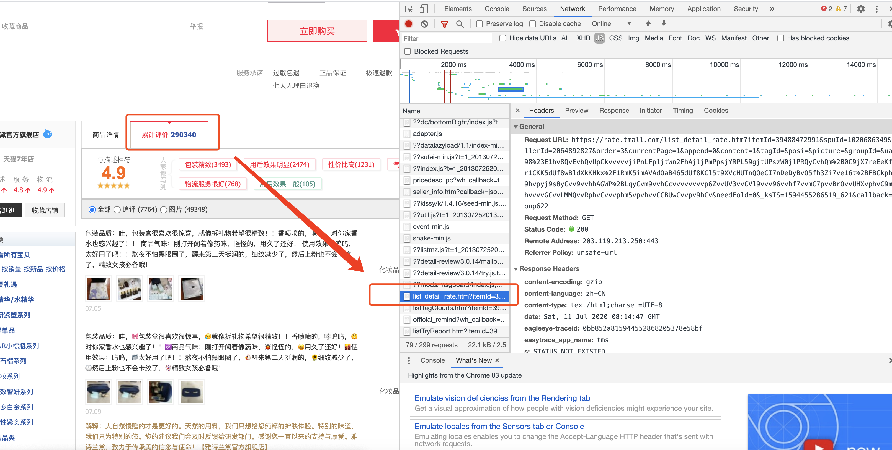
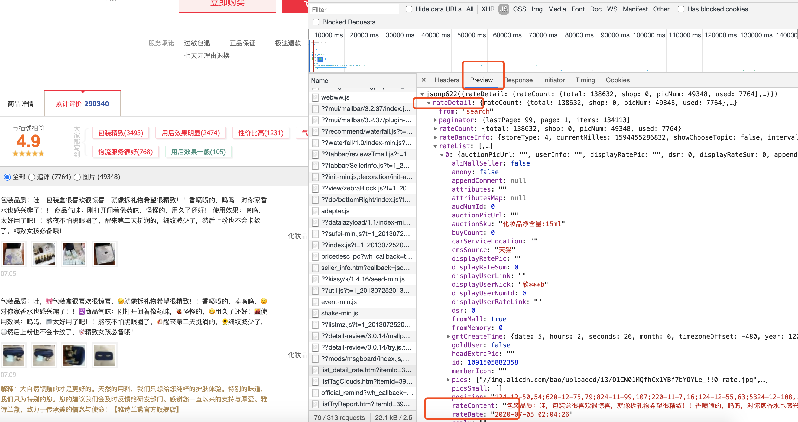
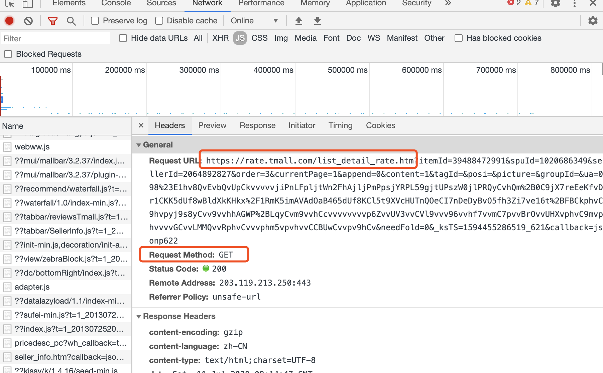
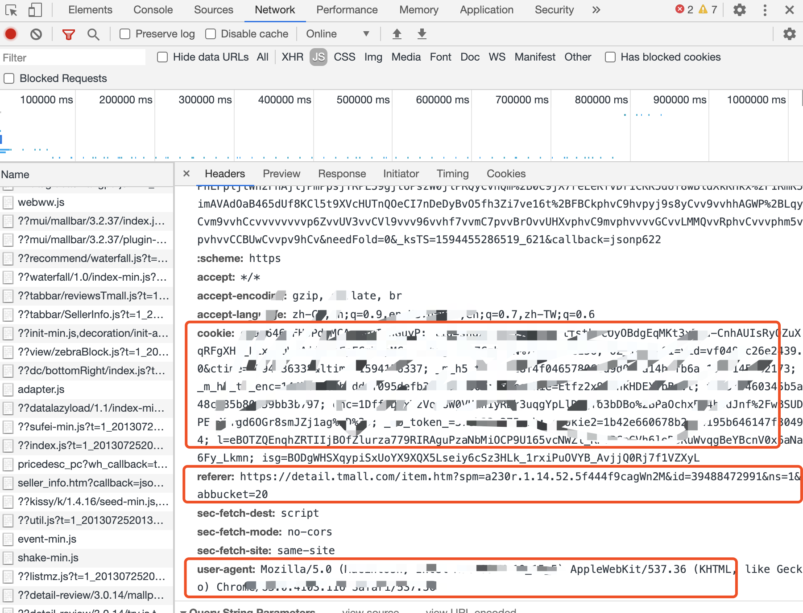
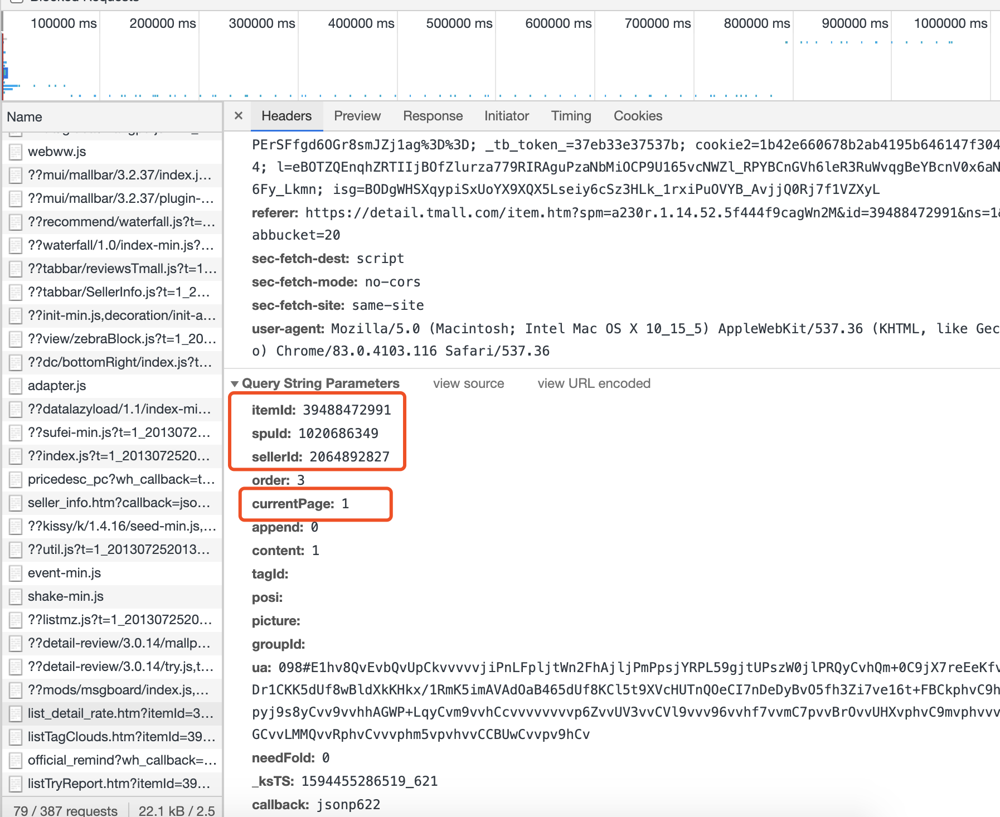
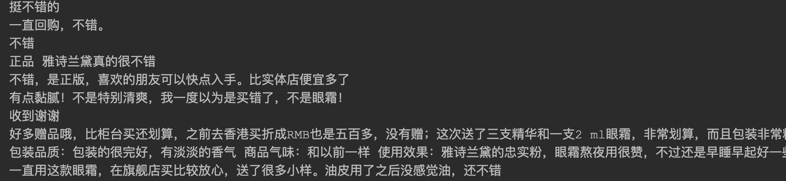

## 淘宝评论爬取

### 淘宝评论禁止爬虫，本教程只是教学，没有爬去大量数据，仅供学习使用，切勿用作商业用途，如果出现违法行为，与本教程无关，后果自负

### 打开淘宝网的评价页面

1. 打开某个商品的评价页面
https://detail.tmall.com/item.htm?spm=a230r.1.14.52.5f444f9cagWn2M&id=39488472991&ns=1&abbucket=20

2. F12查看network

找到对应的评价页面


3. 预览评论数据



### 构造Get请求并获取评论数据



请求链接：  https://rate.tmall.com/list_detail_rate.htm

Headers：这一部分换成你自己的



参数： 主要的参数放上去就可以



代码：

```python
def spiderTaoBao():
    url = "https://rate.tmall.com/list_detail_rate.htm"
    header = {
        # 替换成自己的
        "cookie": "",
        "referer": "https://detail.tmall.com/item.htm",
        # 替换成自己的
        "user-agent": "",
    }
    params = {  # 必带信息
        "itemId": "39488472991",  # 商品id
        "sellerId": "2064892827",
        "currentPage": "1",  # 页码
        "callback": "jsonp873",
    }
    req = requests.get(url, params, headers=header)
    content = req.content.decode('utf-8')[11:-1];  # 解码，并且去除str中影响json转换的字符jsonp873;
```

为什么要转换一下呢，可以通过debug看出，每个JSON数据前面会有个【\r\njson2359()】这部分字符在的话是不能直接进行JSON转换的，推荐一个JSON格式化工具http://www.bejson.com/， 可以将content的JSON串去掉特殊字符，并在这个网址里面校验。


然后根据上述content内容，获取评论数据
```python
print(result['rateDetail']['rateList'][1]['rateContent'])
```
一个基本的demo就处理完成了

### 对上述代码进行封装，爬取全部的数据

```python
import requests
import json
import time
import random

class TaoBao:
    lastPage = 99
    url = "https://rate.tmall.com/list_detail_rate.htm"
    header = {
        "cookie": "",
        "referer": "https://detail.tmall.com/item.htm",
        "user-agent": "",
    }
    params = {  # 必带信息
        "itemId": "0",  # 商品id
        "sellerId": "2064892827",
        "currentPage": "1",  # 页码
        "callback": "jsonp873",
    }

    def __init__(self, id: str):
        self.params['itemId'] = id

    def getPageData(self, pageIndex: int):
        self.params["currentPage"] = str(pageIndex)
        req = requests.get(self.url, self.params, headers=self.header, timeout=2).content.decode(
            'utf-8');  # 解码，并且去除str中影响json转换的字符（\n\rjsonp(...)）;
        req = req[req.find('{'):req.rfind('}') + 1]
        return json.loads(req)

    def setOrder(self, way: int):
        self.params["order"] = way;

    def getAllData(self):
        rateDataList = []
        for i in range(0, self.lastPage + 1):
            time.sleep(random.random() * 3)  # 随机睡眠n秒，模拟人的行为
            pageDate = self.getPageData(i)['rateDetail']['rateList']
            for j in range(0, 20):
                rateDataList.append(pageDate[j]['rateContent'])
                print(pageDate[j]['rateContent'])
        return rateDataList


if __name__ == '__main__':
    taobao = TaoBao("39488472991")
    rateDataList = taobao.getAllData()
    for data in rateDataList:
        print(data)

```

可以看下爬虫效果


### 源码参考

[基本demo](./TaoBao.py)

[封装之后的爬虫](./taobao_baseline.py)


### idea 

可以根据商品评价分数以及商品评论做一个映射，对用户评论自动打分
